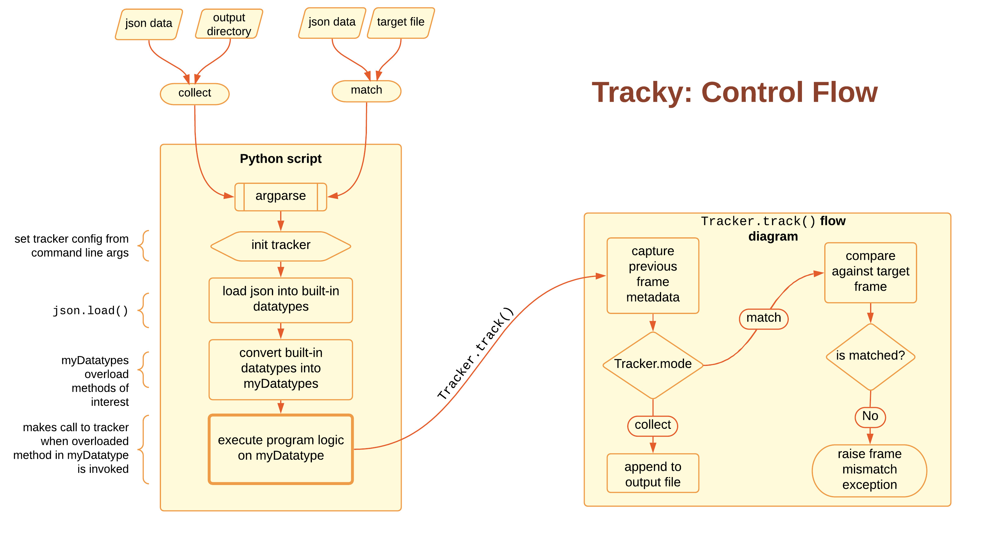

# Silent JSON changes detector
[](https://github.com/GautamGadipudi/tracky/actions/workflows/main.yml) [](https://www.python.org/downloads/release/python-394/)


## Getting the code
Run either of the below commands in the terminal:
```bash
# for https connections
git clone https://github.com/GautamGadipudi/tracky.git

# for ssh connections
git clone git@github.com:GautamGadipudi/tracky.git
```

## Installation

#### Requirements:
1. [](https://www.python.org/downloads/release/python-394/)

#### Install dependencies:
```bash
cd tracky

python -m pip install --upgrade pip
pip install -r requirements.txt
```

``` bash
# Make sure you have modules accessible to the interpretter
export PYTHONPATH="$PYTHONPATH:<your-relative-path-to-repo>/src"
```
## Running the code

---
**NOTE**

All programs are located in `./src/programs/`

---
 
#### 1. As a CLI:
```bash
# see usage and get help
python3 <path-to-a-program> --help
```

```bash
# collect mode
python3 <path-to-a-program> collect 
    --jsoninputpath <filename> 
    --outputdirectory <path>
```

```bash
# match mode
python3 <path-to-a-program> match 
    --jsoninputpath <filename> 
    --targetfile <filename>
```

Use `-v` or `--verbose` to enable verbose console logging

#### 2. Using built-in configurations (scenarios) in VSCode:
This approach is recommended when debugging.

```bash
# open cloned repository in VSCode
code .
```
> or just open the cloned repository in a new VSCode window 

    1. Open the "Run" tab in VSCode
    (shortcut - <kbd>shift</kbd> + <kbd>⌘</kbd> + <kbd>D</kbd>)

    2. Select a scenario to run from the "RUN" dropdown (typically on the top right corner)

    3. Click the green play button ("Start Debugging" button)

#### 3. Run all programs (both collect and match), for all overloaded methods, for all examples
```bash
python3 ./src/tests/run_all.py
```

## Control flow
<div align="center"> </div>
